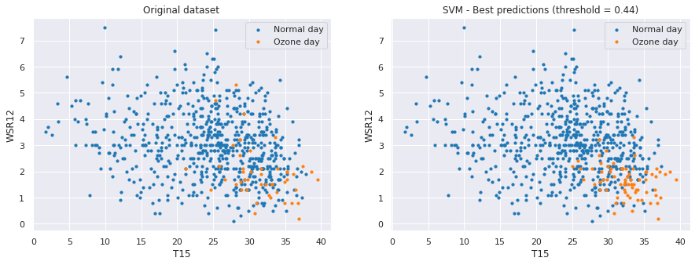

# :foggy:  Ground-level ozone predictions

## About

In this notebook I study the [Ozone Level Detection Dataset](https://archive.ics.uci.edu/ml/datasets/Ozone+Level+Detection) from UCI Machine Learning Repository. 

The goal is to classify days in "ozone days" and "normal days" using information collected from 1998 to 2004 at the Houston, Galveston and Brazoria area. 
An "ozone day" is a day with high concentration of ground-level ozone. 

The project contains a Jupyter Notebook.

### Why is it important to predict "ozone days"? 

In the upper atmosphere, ozone plays a key role in protecting us from the sun's ultraviolet radiation. But, just above the Earth's surface, high levels of ozone can be harmful to our health and the environment.

### Dataset challenges

Analyzing this dataset is a challenging task for two reasons:

- Data has unbalanced classes (6.5% of the examples belong to the "ozone days" class).
- It contains few samples and a large number of features.

## Technologies used

- Jupyter Notebook 
- Python 3
  - Libraries: Matplotlib, Pandas, Seaborn, Sklearn, Imblearn. 

## How to use

Run on terminal the following command:

    $jupyter notebook ground-level_ozone_predictions.ipynb

## Some results

### Best model

A SVM model with RBF kernel gave the best results, with a F1-score of 0.47. In the following scatter plots, I compare the original test set with the predictions. 

Below, I plot the confusion matrix. The model predicts correctly a 61% of all positive examples ("ozone days"). In addition, when the model predicts a day as "ozone day", it is right around 38% of the time.

## Acknowledgments

- To the creators of the dataset  
  Kun Zhang, Wei Fan, XiaoJing Yuan.
- To UCI Repository  
  Dua, D. and Graff, C. (2019). [UCI Machine Learning Repository](http://archive.ics.uci.edu/ml). Irvine, CA: University of California, School of Information and Computer Science. 

----
### Author
Débora Magalí Quindimil

